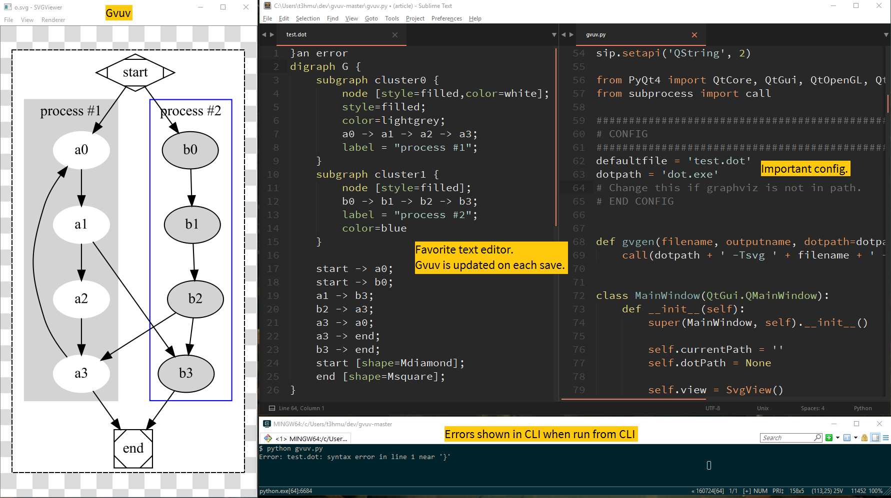

# GVUV - Graphviz Updating Viewer

## Description

A graphviz viewer that updates as you save edits in a text editor.

Edit a graphwiz dot file in your favorite text editor (I use sublime, which has nice sytax highlighting), this app will display your graph and automatically refresh everytime you save your text file.

## Usage

Check the requirements at the bottom of this readme.

The program consists of `gvuv.py` and `gvgen.py`, they must be kept in the same folder.

Start `gvuv.py`. If you don't know how to run python scripts, ask the internet.

If you don't like the console window you can rename `gvuv.py` to `gvuv.pyw`. 
However the console window is useful for viewing errors in the graph you are attempting to display.

Open a dot graph file (must have the `.dot` extension) from the file menu.
It will now be displayed in the viewer (unless there are errors, which will be displayed in the console window). If there are errors you may see the last sucessfully displayed graph instead.

Edit the dot graph file in any text editor. The viewer will update every time you save the file.

__If you encounter any bugs, crashes, or other usability issues feel free to make an issue.__ 

## Status
__All features working__.
* Graph generation and display: __working__.
* Auto-refresh when dot file edited. __working__.
* Fix rough edges __wip__
  * Zoom resets on refresh
  * Dot file errors are not seen in the main window (but you can see them in the console window).
  * The previous graph is displayed when a new graph with an error is opened.

### Milestones

1. SVG Viewer (this is just a qt4 sample with some lines deleted). [done]

2. Refresh SVG shortcut. [done]

3. Generate SVG from .dot file. [done]

4. Generate + Refresh button (same button). [done]

5. Watch .dot file for changes and auto-refresh. [done]

6. Usability improvements - _ongoing_

## Requirements

Python with PyQt4 (tested in WinPython 3.4.2, [WinPython 64 3.5.2.3](https://github.com/winpython/winpython/releases/download/1.7.20161101/WinPython-64bit-3.5.2.3.exe) )
__Update 01/2017:__ WinPython 3.5.2.3 seems to be the easiest way of getting a working Python with Qt4 on Windows.

Graphviz (either put its bin in path, or modify `dotpath` in `gvgen.py`).
If Graphviz is not found a messy file not foun error will occur.

The graph file should have `.dot` as its extension.

## License
3-clause BSD.
